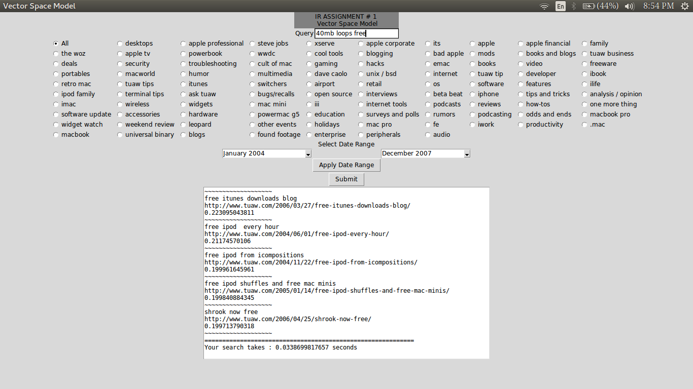
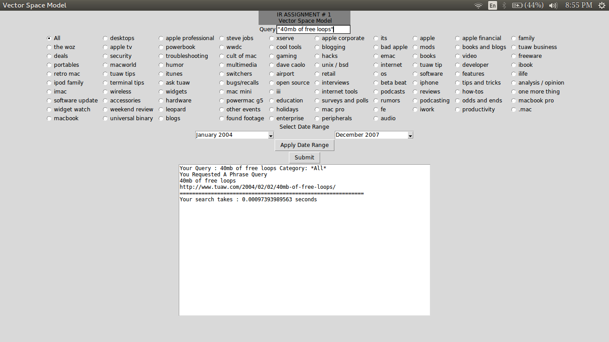
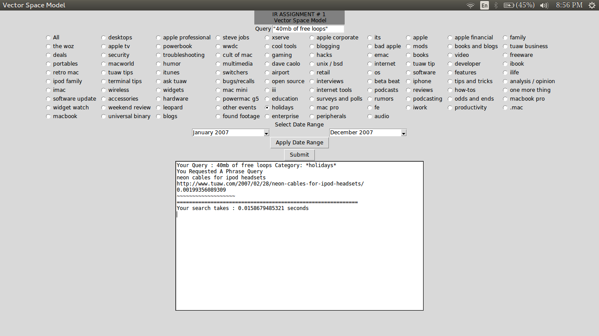

<h1>Vector Space Model</h1>

<b>Course Number :</b> CS F469

<b>Contributors : </b>
<ul>
<li>G V Sandeep</li>
<li>Kushagra Agrawal</li>
<li>Snehal Wadhwani</li>
</ul>

<h3><b>Aim :</b> To implement a retrieval system based on vector space model on the given dataset</h3>

<b>Language :</b> Python v2.7.12

<h6>Working :</h6>
<ol>
<li> The entire corpus is run through a main.py file which extracts the required fields and stores it in the normalized form</li>
<li> For Eg : Date is stored in the form of a UNIX timestamp so that comparison is easier. Outlinks, Inlinks and comments have been recalculated as 1+ log(num) where num is their value. All the words in posts and title are tokenized and stemmed according to Porter's Stemming Algorithm. The words have been stripped of spaces and case sensitivity.</li>
<li> These values are then passed to the file new_inverted.py which constructs a dictionary and forms an inverted index for these individual attributes</li>
<li> These dictionaries are then used by the file tfidf.py which calculates the tf idf (term frequency - inverse document frequency) score</li>
<li> The idf of every word is calculated using the formula log(N/df) where N is the size of the corpus and df is the document frequency of the word. The tf of the word per document is calculated by the formula 1 + log(tf) where tf is the frequency of the word in a particular document. The formula used for weighing the document-query similarity is lnc.ltc (ddd.qqq). The document vector (which has only the tf) is normalised by making it as a unit vector.</li>
<li> Query processing in GUI.py includes tokenization, normalization, tf-idf calculation and normalization of the query vector. The cosine similarity is calculated with the document vectors calculated in tfidf.py. Scores are given according to the similarity with the document's title, blogger and post. If more than two documents have the same score, the clash is resolved by taking into account the no. of inlinks, outlinks and comments. </li>
<li> For query search, the query is broken down into 2 terms each. The corpus is then searched for two words within the given distance (for phrase queries it is one). the returned list is used to run on other pairs of normalised queries to finally return the document which best matches the query</li>
<li> Tkinter GUI of python is used for giving it a more professional look and making it user friendly.</li>
<li> The user has the option to narrow down his results by selecting a particular date range and category of result he wants</li>
</ol>

<h6>Setting it up:</h6>
<ol>
	<li>Extract the folder and then run GUI.py. That's it :D </li>
	<li>It takes around 14 minutes for the GUI.py to pre-process the data.</li>
</ol>

<h3>Screenshots</h3>

<b>Normal Query</b>

<b>Phrase Query</b>

<b>Phrase Query with topic slicing</b>
